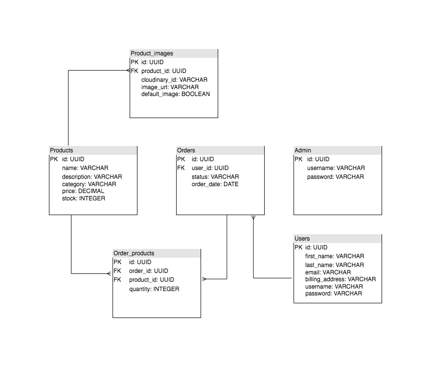

# API Requirements
The company stakeholders want to create an online storefront to showcase their great product ideas. Users need to be able to browse an index of all products, see the specifics of a single product, and add products to an order that they can view in a cart page. You have been tasked with building the API that will support this application, and your coworker is building the frontend.

These are the notes from a meeting with the frontend developer that describe what endpoints the API needs to supply, as well as data shapes the frontend and backend have agreed meet the requirements of the application. 

## API Endpoints
#### Products
- Index [GET /products]
- Show (args: product id) [GET /products/:id]
- Create [token required] [POST /products]
- Update (args: product id) [token required] [PUT /products/:id]
- Add Image (args: product id) [token required] [POST /products/:id/image]
- Delete (args: product id) [token required] [DELETE /products/:id]
- Top 5 most popular products [GET /products/top]
- Products by category (args: product category) [GET /products/category/:category]

#### Admin
- Create [POST /admin]
- Authenticate [POST /admin/login]

#### Users
- Index [token required] [GET /users]
- Show (args: user id) [token required] [GET /users/:id]
- Create [POST /users]
- Update (args: user id) [token required] [PUT /users/:id]
- Delete (args: user id) [token required] [DELETE /users/:id]
- Authenticate [POST /users/login]

#### Orders
- Create [token required] [POST /orders]
- Add Product to Order (args: order id) [token required] [POST /orders/:id/products]
- Current Order by user (args: user id) [token required] [GET /orders/users/:id/current]
- Completed Orders by user (args: user id) [token required] [GET /orders/users/:id/completed]

#### Dashboard
- View Products in Orders [token required] [GET /products-in-orders]

## Data Shapes
#### Product
-  id
- name
- description
- price
- stock
- category
- image url of the product

#### Admin
- id
- username
- password

#### User
- id
- firstName
- lastName
- email
- billingAddress
- username
- password

#### Orders
- id
- id of each product in the order
- quantity of each product in the order
- user_id
- status of order (active or complete)
- date of the order

## Database Schema

